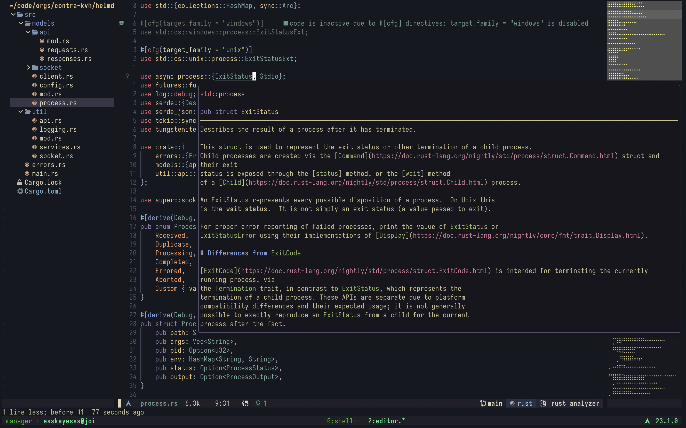

<h1 align="center">
  esskayesss' neovim config.
</h1>

  
   
  <i>colorscheme: kanagawa • terminal: kitty • tmux</i>

## colorscheme

  
  

    My config uses the <a href="https://github.com/rebelot/kanagawa.nvim">kanagawa</a> theme. It's one of the most perfect colorschemes I've come across of late.
    I was enjoying how pleasant Gruvbox was to the eye and yet wanted something darker. I will be using a darker configuration of it extensively throughout my rice, all of which can be 
    found in the <a href="https://github.com/esskayesss/dots"> <code>dots</code></a> repository. It's great that the author has publicized the palette.
  

## plugins

My config uses [packer](https://github.com/wbthomason/packer.nvim) to manage its plugins.

### statusline and colorscheme
- [lualine.nvim](https://github.com/nvim-lualine/lualine.nvim) - A customizable statusline.
- [kanagawa.nvim](https://github.com/rebelot/kanagawa.nvim) - A stylish colorscheme.

### utilities
- [telescope](https://github.com/nvim-telescope/telescope.nvim) - A highly extendable fuzzy finder.
- [telescope file browser](https://github.com/nvim-telescope/telescope-file-browser.nvim) - A file browser powered by telescope.
- [harpoon](https://github.com/theprimeagen/harpoon) - Easy file navigation with Primeagen's plugin.
- [undotree](https://github.com/mbbill/undotree) - Enhanced undo history management.
- [symbols outline](https://github.com/simrat39/symbols-outline.nvim) - An outline view for symbols.
- [minimap.vim](https://github.com/wfxr/minimap.vim) - A minimap extension.
- [vim floaterm](https://github.com/voldikss/vim-floaterm) - A floating terminal.
- [lazygit.nvim](https://github.com/kdheepak/lazygit.nvim) - Integration with Lazygit.
- [nvim-tree.lua](https://github.com/nvim-tree/nvim-tree.lua) - A file system navigator.

### coding utilities
- [gitgutter](https://github.com/airblade/vim-gitgutter) - Show Git changes in the sign column.
- [vim fugitive](https://github.com/tpope/vim-fugitive) - Git integration for Neovim.
- [vim commentary](https://github.com/tpope/vim-commentary) - Easily comment and uncomment lines.
- [vim illuminate](https://github.com/RRethy/vim-illuminate) - Highlight other instances of the current word.
- [vim css color](https://github.com/ap/vim-css-color) - Highlights hex color codes.
- [vimspector](https://github.com/puremourning/vimspector) - A powerful debugger for Neovim.
- [nvim-dap](https://github.com/mfussenegger/nvim-dap) - Debug Adapter Protocol for Neovim.
- [trouble.nvim](https://github.com/folke/trouble.nvim) - A plugin for managing and fixing code issues.
- [indent blankline](https://github.com/lukas-reineke/indent-blankline.nvim) - Show indent guides.
- [nvim autopairs](https://github.com/windwp/nvim-autopairs) - Auto-pairs for Neovim.

### language-specific plugins
- [crates.nvim](https://github.com/saecki/crates.nvim) - Rust crate information.
- [rust tools](https://github.com/simrat39/rust-tools.nvim) - Tools for Rust development.

### completion and lsp
- [nvim-cmp](https://github.com/hrsh7th/nvim-cmp) - A fast and powerful completion framework.
- [cmp-nvim-lsp](https://github.com/hrsh7th/cmp-nvim-lsp) - LSP completion source for nvim-cmp.
- [cmp-nvim-lua](https://github.com/hrsh7th/cmp-nvim-lua) - Lua completion source for nvim-cmp.
- [cmp-nvim-lsp-signature-help](https://github.com/hrsh7th/cmp-nvim-lsp-signature-help) - Signature help source for nvim-cmp.
- [cmp-vsnip](https://github.com/hrsh7th/cmp-vsnip) - Snippet source for nvim-cmp.
- [cmp-path](https://github.com/hrsh7th/cmp-path) - Path source for nvim-cmp.
- [cmp-buffer](https://github.com/hrsh7th/cmp-buffer) - Buffer source for nvim-cmp.
- [vim-vsnip](https://github.com/hrsh7th/vim-vsnip) - Snippet engine for Neovim.
- [lsp-inlayhints.nvim](https://github.com/lvimuser/lsp-inlayhints.nvim) - Inlay hints for LSP functions and methods.
- [lspkind.nvim](https://github.com/onsails/lspkind.nvim) - LSP Icons

## keymaps

*TODO*

## contributing

Now, this is a personal config, mostly with things that seem to work best for me. However, the repo is always open to good suggestions. 
Feel free to fork it and customize it to your own liking, and creating PRs with improvements.
